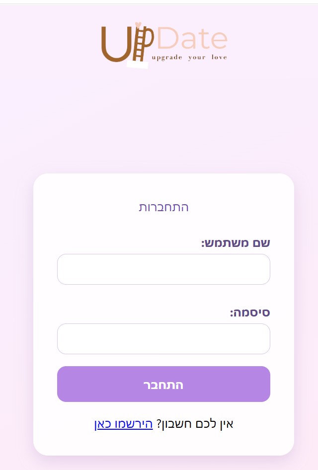
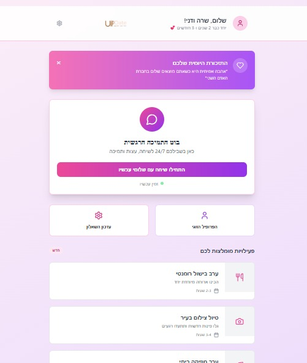
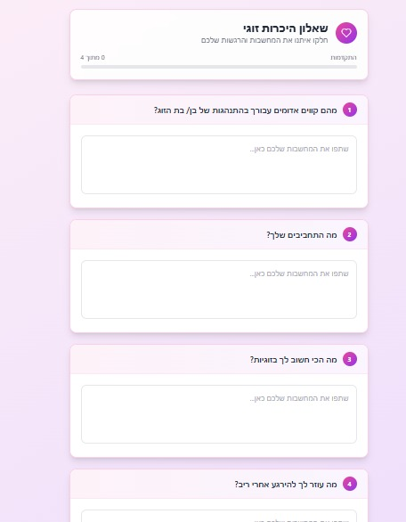
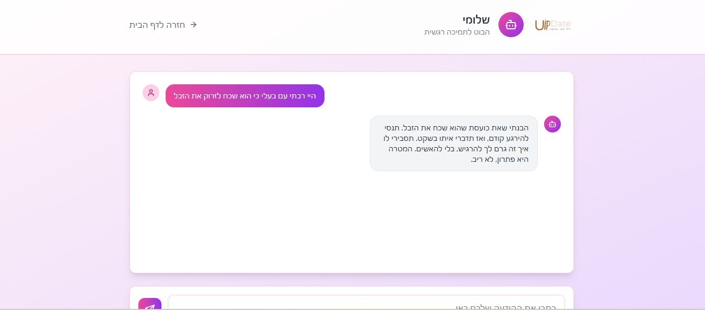
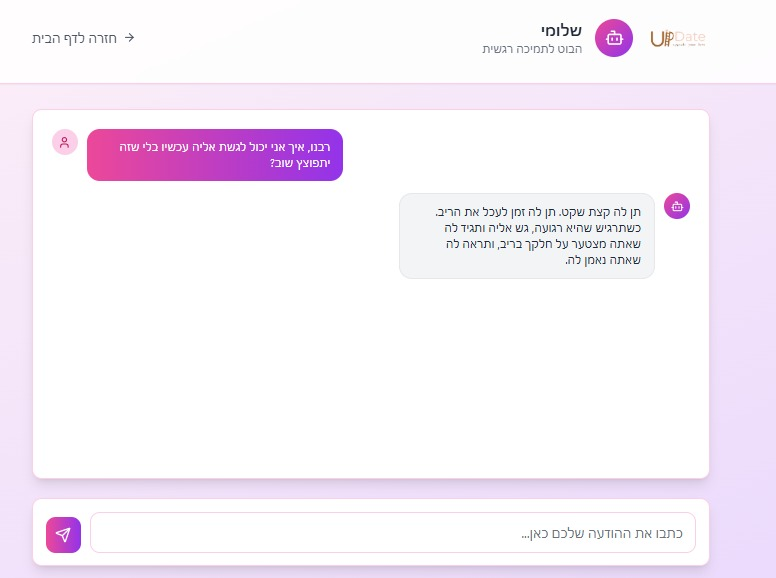

# 💬 Update

**Update** is a web application designed for couples to help improve their communication and deepen their relationship.
The platform offers features and conversation bot.

---

## 🧠 Features
 
 

 
 
- 🤖 Chatbot for thoughtful, guided conversations
- 💾 Cloud database with Supabase
- 🌐 Modern, responsive frontend built with React
- 🔐 Backend API powered by Python
- 👫 Designed specifically to support healthy communication for couples

---

## 🛠️ Tech Stack

- **Frontend:** React.js
- **Backend:** Python 
- **Database:** Supabase 

---

## 🚀 Getting Started

### Prerequisites

- Node.js and npm
- npm start

### Backend

cd backend
pip install -r requirements.txt
python main.py

© 2025 Update – All rights reserved to the authors.

Ayelet Benisty – github.com/Ayelet929

Malka Haupt – github.com/malka00

Ruth Kalimy – github.com/RutK100

Sara Mager – github.com/saramager

